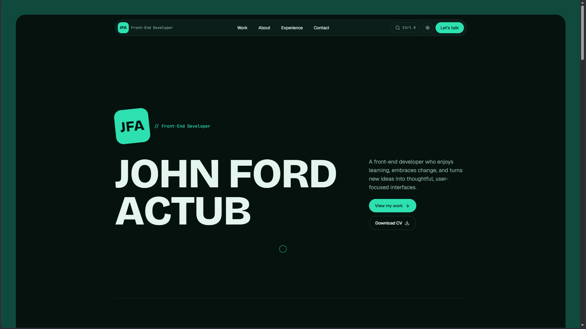

# John Ford Actub — Portfolio

Personal portfolio of **John Ford Actub**, a front-end developer with 2 years of professional experience building responsive, user-friendly web applications with React and TypeScript.

**Live site:** https://johnfordactub.vercel.app



## Highlights

- **Scroll-driven motion** — Lenis smooth scrolling with GSAP ScrollTrigger, including pinned project cards that stack over one another
- **Hero intro in pure CSS**, so the name paints immediately and doesn't depend on JavaScript
- **Light and dark themes** in a teal palette, following the system setting with a manual toggle
- **Command palette** (`Ctrl/⌘ + K`) to jump to sections and projects, switch theme, copy my email and open my CV
- **Custom cursor** that reacts to links and project cards (fine pointers only)
- **Contact form** with client and server validation, a honeypot, and per-IP and global rate limiting
- **Data-driven case studies** — adding a project means adding one entry to a data file
- **SEO** — per-page metadata, generated Open Graph images, sitemap, robots and JSON-LD structured data
- **Accessibility** — skip link, keyboard-friendly controls, labelled form fields, and `prefers-reduced-motion` support that turns off the heavy effects

In my latest Lighthouse runs on the production site (mobile), I got Performance 87–89 and 100 for Accessibility, Best Practices and SEO. Lab scores vary between runs.

## Tech stack

| Area                  | Tools                                                                  |
| --------------------- | ---------------------------------------------------------------------- |
| Framework             | Next.js (App Router), React, TypeScript                                |
| Styling               | Tailwind CSS, `next/font` (Bricolage Grotesque, Geist, JetBrains Mono) |
| Motion                | GSAP + ScrollTrigger, Lenis, CSS keyframes                             |
| Forms                 | React Hook Form, Zod                                                   |
| Email and limits      | Resend, Upstash Redis (`@upstash/ratelimit`)                           |
| UI                    | cmdk, next-themes, lucide-react                                        |
| Hosting and analytics | Vercel, Vercel Analytics, Speed Insights                               |
| Quality               | ESLint, `tsc`, GitHub Actions CI                                       |

## Getting started

Requires Node.js 20.9 or later.

```bash
git clone https://github.com/Jampord/Developer-Portfolio.git
cd Developer-Portfolio
npm install
cp .env.example .env.local   # on Windows PowerShell: copy .env.example .env.local
npm run dev
```

Open http://localhost:3000.

### Environment variables

| Variable                   | Required             | Purpose                                                                             |
| -------------------------- | -------------------- | ----------------------------------------------------------------------------------- |
| `RESEND_API_KEY`           | For the contact form | Sends contact messages through Resend                                               |
| `CONTACT_TO_EMAIL`         | For the contact form | Where messages are delivered                                                        |
| `UPSTASH_REDIS_REST_URL`   | Optional             | Rate limiting store                                                                 |
| `UPSTASH_REDIS_REST_TOKEN` | Optional             | Rate limiting store                                                                 |
| `NEXT_PUBLIC_SITE_URL`     | Optional             | Overrides the site URL used for metadata (defaults to the Vercel production domain) |

Without the Upstash variables the form still works, with rate limiting turned off. Never commit `.env.local`.

### Scripts

| Command             | What it does                                 |
| ------------------- | -------------------------------------------- |
| `npm run dev`       | Start the dev server                         |
| `npm run build`     | Production build                             |
| `npm run start`     | Serve the production build                   |
| `npm run lint`      | Run ESLint                                   |
| `npm run typecheck` | Run the TypeScript compiler without emitting |

## Project structure

```
src/
  app/
    api/contact/        Contact form endpoint (validation, rate limit, Resend)
    projects/[slug]/    Case-study pages and their share images
    opengraph-image.tsx, icon.tsx, sitemap.ts, robots.ts
  components/           Sections (hero, work, about, experience, contact), nav, palette, cursor
  data/
    projects.ts         Project content
    profile.ts          Bio, skills and work history
  lib/                  Site config, URL helper, validation schema, rate limiter
public/                 Images and the CV
```

## Adding a project

1. Add screenshots to `public/projects/<slug>/`.
2. Add an entry to `src/data/projects.ts`. The card, case-study page, share image, sitemap entry and command-palette item are all generated from it.

## Workflow

`main` is protected. Every change goes through a short-lived branch and a pull request, and CI (lint, typecheck, build) must pass before a squash merge. Each pull request also gets a Vercel preview deployment.

## About the work shown

Some projects here were built for an employer and are under NDA, so their screenshots have sensitive data removed and the client is described generically.

## License

© 2026 John Ford Actub. All rights reserved. The source code is public for reference only and may not be copied or reused without permission.
